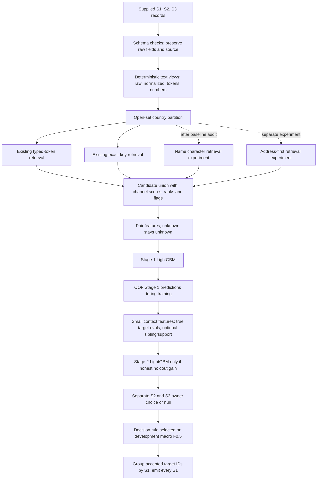

# Amazon ML Challenge 2026
# Final Entity Resolution Architecture V2

**Purpose:** an evidence-led revision of `FINAL_ARCHITECTURE.md` and `ARCHITECTURE_REVIEW.md`.

**Status:** research/design only. This document does not describe an implemented or measured V2. It does not change the production code, train models, or process the full test set. Proposed capability improvements below are hypotheses until their experiments are run.

## 1. Executive recommendation

Keep the existing sparse retrieval and LightGBM foundation. First make the current experiment trustworthy: preserve candidate provenance; eliminate validation leakage in Stage 2; generate out-of-fold (OOF) Stage 1 scores; compute real target-side winner/runner-up margins; populate context features only from valid OOF predictions; apply one-owner assignment separately to S2 and S3; and evaluate the whole S1 match list using the competition's macro F0.5.

Then improve recall with one small, high-value addition at a time. The first retrieval experiment should be character n-grams over the business name. In parallel, test low-cost address-first keys and address evidence so an absent name does not prevent retrieval. Treat address parsing, address-character retrieval, and multilingual dense retrieval as separate, gated experiments. Dense retrieval is a late candidate-only experiment, not a replacement matcher or default dependency.

Use actual error strata to decide whether any further technique is warranted. The capability scores in the request and previous documents are prioritization judgments, not validation results. The workspace has no experiment ledger or generated prediction files to substantiate them.

## 2. Evidence status and scope

### 2.1 Current workspace baseline

Inspection of `src/pipeline.py`, `src/config.py`, `models/config.json`, artifact presence, data layout, the README, and the whitepaper indicates:

- **Implemented retrieval:** country partition; custom typed-token inverted retrieval with per-record top 8; exact structured keys with per-record top 8; union of those candidates. Typed tokens include name, address, number, number+street, and number+name evidence.
- **Implemented pair model:** LightGBM Stage 1 with name/address/token/number/legal-form features. A saved Stage 1 pickle and Stage 2 pickle exist.
- **Current weaknesses visible in code:** the stored `retrieval_score` defaults to a constant and `retrieval_rank` can reflect union iteration order; Stage 2's validation feature rows are used both to fit and score the Stage 2 model; `sibling_probs` is passed empty; and the S1 gap does not compare against the true second-best competing record. These features cannot support the intended decisions as written.
- **Configuration/artifacts:** `models/config.json` stores threshold `0.30`, `use_stage2: true`, and `macro_f05: 0.836339...`; the metric is not independently verifiable from this workspace because outputs, evaluation predictions, and experiment records are absent. The pickles establish artifact presence, not artifact quality or provenance.
- **Not implemented in the current path:** name or address character-ngram retrieval, BM25, dense embeddings, a confidence-aware address parser, populated sibling reasoning, calibrated scores, and one-owner assignment. `ADDRESS_ABBREVS` is configured but unused. Preserve raw and normalized text if these are added.
- **Scale:** input TSVs are hundreds of MB each. Avoid materializing every pair, dense all-pairs similarities, or a large cross-encoder pass. The expected machine profile is CPU-first; no verified GPU/RAM budget is provided here.

### 2.2 Competition rules and specification

The project README is the available official competition specification. It states that every test S1 requires an output row; an S1 may link to zero or many S2/S3 records; empty lists are valid; predictions must be in the final candidate set; evaluation is macro F0.5 per S1 including singletons; France occurs in test but not labeled training; and external entity lookup, APIs, geocoding, and internet data augmentation are prohibited. Model license and parameter restrictions in the project materials also remain binding. Recheck the actual challenge terms before submission if newer official materials are supplied.

The user-provided whitepaper reports **zero repeated target owners among 7,638,365 distinct labeled target IDs**. That is strong support for a one-owner constraint in training, but the forensic script/report is missing from this workspace. This V2 treats it as a reported full-label audit that should be reproducible before a hard production invariant is adopted. S2 and S3 ownership are independent; S1 capacity remains unlimited.

The same whitepaper reports useful patterns (shifted-number decoys, address-only positives, within-source address siblings, multilingual records). The report and associated forensic artifacts are unavailable, so these are **friend-reported findings**, not independently verified here. Retest each pattern using training labels and disclose sample sizes. In particular, do not assume one numeric span is the house number, that all “same address” records are the same business, or that country transfer performance predicts France performance.

### 2.3 What this V2 changes from the prior documents

The prior `FINAL_ARCHITECTURE.md` proposes char retrieval and parsed addresses as if they belong in the main path, and its first diagram includes RRF and multiple speculative channels. The review later argues for a leaner default but does not update the architecture file. V2 resolves that mismatch: **current path = typed + exact + LightGBM; default repair = leakage-safe scoring/decision; first retrieval addition = name char n-grams only after a baseline recall audit; all other channels/parsers = isolated ablations.** RRF is only considered if a hard cap actually requires rank fusion.

## 3. Target architecture

Retrieval proposes candidate edges; the matcher scores candidate edges; the decision layer assigns each target record to one S1 or null. Candidate recall is a ceiling, so report it before tuning pair classification. The candidate artifact in the final package must represent the exact candidate set fed to the inference matcher, as the README specifies.

## 4. Decisions by component

Decision labels mean: **KEEP** in the baseline; **ADD** to the default after the stated verification; **ABLATION** run as an isolated experiment; **REJECT** from the present plan unless new evidence changes the case.

| Weakness / component | Why baseline may struggle | Proposed change and pipeline location | Benefit, cost, precision risk | Decision and proof required |
|---|---|---|---|---|
| Semantic aliases and name typos | Typed tokens need shared surface tokens. Typos, abbreviations, reordered terms, transliteration, and full DBA/rebrand aliases can have little exact overlap. Dense semantics can also confuse businesses with similar descriptions. | Add a separate character 3-5 gram name index after the baseline; retain token retrieval. Preserve raw/core/legal-form views. Test a small multilingual embedding index only for residual cross-script/alias misses. | Char grams: moderate index/build cost, likely surface-form recall gain; false candidates from common names. Dense ANN: high encoding/index cost and possible semantic false positives. | **ADD** char-ngram experiment first. **ABLATION** multilingual embeddings candidate-only. Measure unique true-pair recall, edge count, runtime, memory, and final macro F0.5. Never infer identity from embedding similarity alone. |
| Missing business name | A name-dependent key cannot find a record with empty/noisy name. | Add a separate address-first candidate path using exact/high-confidence combinations available in raw supplied fields: normalized number+street token, postal+locality, street+city, or rarer locality/street token. Query only keys with controlled document frequency; preserve which key found each edge. | Moderate postings/candidate volume; should expose name-missing positives. Shared buildings/localities can create many false candidates; do not use a broad city-only block. | **ABLATION**, high priority after baseline. Report recall for name-empty records, candidates/query and long-tail block size. Compare final macro F0.5 and singleton false-positive rate. |
| Missing address | Address evidence disappears, so core-name duplicates/common names are hard to disambiguate. | Keep a name-only route in the existing typed retrieval; add name character retrieval as a separate channel. In matching features include address-missing flags and make missing address comparisons neutral rather than zero-as-conflict. | Low extra feature cost; character index has moderate memory cost. Common names increase false candidates. | **ADD** missingness flags and verify current handling. **ABLATION** name-char retrieval. Measure by address-availability slice and common-name frequency deciles. |
| Severe/corrupted addresses | Current address tokens and all-number sets blur roles; `ADDRESS_ABBREVS` is unused, and a raw integer may be unit, floor, route, postal code, or primary number. | First add conservative deterministic alternate views: Unicode/spacing/punctuation normalization; country-agnostic observed abbreviations; raw numeric spans; numeric exact/prefix/nearby relations as separate features. Evaluate parser component accuracy before feeding confidence-tagged house/unit/street/locality/city/state/postal features. | Normalization/features are cheap; parsing is moderate work and may be wrong, especially under France shift. False precision risk if a wrong role is treated as a hard conflict. | **ADD** safe views as an experiment. **ABLATION** parser; unknown or low-confidence fields must be neutral. Sample component-level precision/recall by country/source and show parser errors before any block or veto. |
| Different name, same address | Existing name-heavy retrieval/ranking may omit correct pairs; address-only similarity can collapse tenants in one building. | Address-first candidate path plus structured address pair evidence. Separate primary-number, unit, road, locality, city, region, and postal features only when confident; combine address agreement with name conflict and target competition. | Candidate recall gain for rebrands/name failure; moderate cost. Same-building businesses are a substantial precision risk. | **ABLATION** address channel and parsed features independently. Measure recall on low-name-similarity positives and false positives on same-address/different-name hard negatives. No address-only automatic match. |
| Multilingual/transliteration and unseen France | Literal normalization may not bridge scripts or language-specific abbreviations. France has no labeled target validation set. | Keep original script and deterministic transliteration as distinct views; add multilingual embedding retrieval only if it contributes unique labels on Indian cross-script holdout. For France, use open-set country blocking and language-agnostic numeric/token/character features. Derive unsupervised vocabulary/statistics from supplied records only if they are also available at serving time. | Transliteration is low/moderate cost but can conflate forms. Embeddings are high CPU/storage and license/provenance cost. Unlabeled target statistics cannot estimate target precision. | **KEEP** language-neutral paths and separate views. **ABLATION** embedding channel on labeled cross-script data. France performance remains unknown; report proxy holdouts and uncertainty, no invented score or France-specific threshold. |
| Common/ambiguous names; hard negatives | Top score alone overstates confidence when many near-identical S1 candidates compete. Union rank is not a genuine rank, and current gap is not a true runner-up gap. | Compute real per-target top-1, top-2, margin, rank, candidate count; add address/number conflict, retrieval channel provenance, and top rival pair evidence. Mine OOF false positives and explicit same-name/different-address, same-address/different-name, shifted-number, and channel-disagreement negatives only when labels establish they are negatives. | Low/moderate feature and mining cost; biased mining may distort deployment prevalence or mark an unlabeled true pair negative. | **ADD** corrected rank/margins and modest verified negative slices. **ABLATION** OOF mining. Compare macro F0.5, calibration by candidate-count/common-name slice, and singleton FP. Preserve natural candidate validation distribution. |
| Cross-source support and sibling evidence | S2/S3 duplicates may corroborate a candidate, but the sources can disagree and correlated edges can amplify a wrong match. Current sibling inputs are empty. | Build support from OOF scores only; keep S2 and S3 evidence separate (max/indicator/count, not an unbounded sum). Try same-source sibling support only after a conservative address signature has measured precision. Exclude the candidate edge itself from its own support calculation. | Moderate joins/feature cost. A false supported edge can bootstrap more errors; sibling addresses can represent multiple tenants. | **ABLATION** after OOF Stage 2 baseline. Require a holdout gain, support-feature coverage, and no subgroup regression; otherwise omit the feature. No graph propagation. |
| Candidate recall and cap | Existing top-8 channels may miss positives; no local recall/volume report exists. Additional per-channel top-K lists multiply total edges. | First measure candidate recall and oracle macro F0.5 for existing channels separately and union. Then add one channel at a time; sweep small fixed K/caps. Keep channel scores/ranks/flags. Use RRF only if a global hard cap needs an ordering comparison. | Candidate audit is required but light compared with full scoring; wider K increases feature/model cost. RRF itself is cheap but may discard a unique strong-channel true pair under a cap. | **KEEP** current channels as baseline. **ADD** ledger and candidate audit before matcher tuning. **ABLATION** each new channel and cap. Gate on unique true-pair recall per extra million edges and final F0.5. |
| Stage 2 / entity competition | Current validation reuse leaks labels; empty sibling evidence and incorrect gap make entity reasoning ineffective/unreliable. Pair classifier alone does not resolve a target with several S1 candidates. | Train Stage 2 only from grouped OOF Stage 1 predictions. For each S2/S3 record compute actual best/runner-up candidate score and margin; optionally include OOF cross-source/sibling evidence. Retain binary Stage 2 with explicit unmatched/null calibration; compare to Stage 1 alone. | OOF requires extra fits and careful fold orchestration; memory/time moderate. Poor folds or mismatched candidate universes can cause optimistic or invalid features. | **ADD**, first priority repair. Stage 2 is retained only if it beats Stage 1 on untouched entity-disjoint evaluation under macro F0.5 and has no material subgroup collapse. Ranker is only a later ablation. |
| One-owner and null/singleton decision | Independent edge thresholding can assign one target record to multiple S1s. Conversely, naive argmax forces a false owner. The official metric evaluates complete per-S1 lists, not pair accuracy. | For each target record, compare S1 candidates and select at most one owner or null. Implement separately for S2 and S3. Tune a global threshold and optional margin on development predictions using exact per-S1 macro F0.5. Keep S1 unlimited capacity. | Small inference overhead. If the train invariant fails to transfer, one-owner could suppress a valid test relation; argmax without null can hurt singleton precision. | **ADD after reproducing the training audit.** Compare independent threshold, owner+null, and owner+null+margin on locked holdout. Confirm all outputs obey candidate subset. Do not call pair-probability threshold “calibration” absent reliability checks. |
| BM25 / learned blocks / graph / cross-encoder | These can add capacity, but current evidence does not identify a need or fit the full inference budget. | BM25 only if lexical char/typed channels miss complementary positives. Learned blocking only if repeated measurable errors justify retraining. No graph propagation or cross-encoder in baseline. | Moderate-to-high compute and dependency complexity; graph/cross-encoder scale and error propagation risks. | **ABLATION** BM25 only. **REJECT** graph/cross-encoder and learned blocking for now. Reopen only after residual error audit and costed prototype demonstrate a material benefit. |

### Exact definition of candidate-generation success

For labeled holdout positives, report (a) recall of each retrieval channel; (b) union recall; (c) incremental recall of the new channel among positives not already found; (d) candidates and unique edges per target and by country/source/name/address availability; (e) high-frequency key truncation; and (f) **oracle macro F0.5** under perfect classification of candidates. Oracle score is a useful ceiling, not a deployable result. Compare end-to-end macro F0.5 with an identical matcher and decision layer, so retrieval and matching effects are not conflated.

## 5. Leakage-safe training and validation protocol

### 5.1 Locked evaluation

1. Use a deterministic S1-entity split, stratified by source/country where possible. No S1 entity or its labeled target records may leak across model-fit and evaluation folds. Keep distractors/near-miss records with the correct fold where their generating relation is known; do not create an easier validation distribution by dropping them.
2. Keep one untouched validation fold for model/threshold selection. A second geographic/state-style holdout can test robustness where training metadata permits, but do not claim this estimates France. A reverse US/India transfer is only a coarse stress test because language, source process, and country are confounded.
3. Build candidate lists with the same direction, universe, top-K, frequency pruning, and allowed unlabeled corpus visibility expected at inference. Report candidate ceiling before model results. Fit any supervised dictionary, learned transliteration mapping, parser adaptation, IDF, calibration, or threshold only inside its training fold. Label-free index statistics are allowed only when the same records would be visible at inference and the setup is documented.
4. For Stage 2 training, generate Stage 1 predictions for every training edge from a model that did not train on that edge's S1 group. Construct all context features from these OOF predictions; use the same feature recipe at validation/inference. Do not fit or tune Stage 2 on the validation predictions it is scored on.
5. Mine hard negatives from training OOF predictions only. Confirm candidate pairs against complete training labels before labeling as negatives. Do not mine on the locked validation labels. Keep sampled training negatives distinct from evaluation prevalence; if sampling changes the candidate class prior, track sampling and evaluate decisions on natural candidate prevalence.
6. Tune the final rule on grouped predictions using the exact per-S1 macro F0.5 including empty ground-truth and empty-prediction cases. Report precision, recall, singleton accuracy, false positive S1s, and calibration diagnostics as supporting measures, not substitutes for the objective.

GroupKFold and calibration references are useful methodological guides, but a group split alone is not sufficient: the candidate universe and every learned preprocessing step must also respect fold boundaries. Calibrated pair probability does not automatically optimize a non-additive list metric.

### 5.2 France without labels

No valid experiment can directly estimate France macro F0.5 without labels. The defensible approach is to avoid country-ID memorization; preserve original text; keep numeric, token, character, and address evidence with confidence; measure US/India source and geographic transfer; inspect label-free France data only for schema and feature coverage; and use the same globally selected decision policy unless official labeled evidence later becomes available. Do not apply external French gazetteers, registries, maps, address databases, web search, or identity APIs. A language-specific normalizer may be tested only from supplied data and must not be framed as proven France improvement.

## 6. Prioritized implementation roadmap (future work; not performed here)

| Priority | Work package | Scope and go/no-go rule |
|---|---|---|
| P0 | Reproduce the current baseline | Recreate a held-out prediction artifact and experiment manifest; report candidate recall/oracle ceiling, macro F0.5, subgroup metrics, edge counts, peak memory and runtime. If the configured 0.836 score cannot be reproduced, resolve that before adding features. |
| P1 | Repair validity | Build grouped OOF Stage 1 predictions; fix actual channel score/rank provenance, target runner-up/margin, and remove empty/invalid context features. Apply separate S2/S3 one-owner-plus-null decision only after reproducing the train ownership audit. Compare Stage 1 and repaired Stage 2 on untouched holdout. |
| P2 | Improve name-side recall | Add a 3-5 character n-gram name retrieval arm with conservative high-document-frequency pruning and a small fixed top-K. Retain only if its incremental true-pair recall justifies added edges and end-to-end macro F0.5 is neutral or better. |
| P3 | Address-first/missing-field audit | Quantify positives and errors where name/address is missing or weak. Test address keys and low-cost structured evidence as independent arms. Audit number-role/parser accuracy before structured parsing; never veto on an uncertain parse. |
| P4 | Decision and negative mining | From training OOF false positives, test verified hard-negative slices; sweep null threshold/margin on development only. Require a gain on locked macro F0.5 and stable singleton/common-name behavior. |
| P5 | Higher-cost research | Test address character retrieval, BM25, then multilingual dense retrieval only against their relevant residual error slices. One experiment per arm; log unique recall per added million edges, CPU time, peak resident memory, model/index size, license/provenance and end-to-end score. Stop if the budget or recall-per-edge is poor. |

### Compute guardrails

Use country-at-a-time or bounded batches; stream/read only required TSV columns; deduplicate candidate edges before feature generation; avoid storing all pairwise text or dense similarity matrices; record index size, peak resident memory, elapsed CPU time and candidate edge count for every arm. Establish a RAM/time budget on a representative slice first, then extrapolate cautiously. The workspace does not provide a verified machine specification, so this design deliberately makes no exact runtime or memory promise. Do not run the full 10M+ test records as part of this architecture pass.

## 7. Explicit keep / add / experiment / reject summary

- **KEEP:** country as an open-set candidate partition; typed-token retrieval; exact structured-key retrieval; LightGBM as the initial pair model; per-field provenance; S1 unlimited match capacity; separate S2/S3 target universes; raw strings alongside derived text; candidate generation separate from matching.
- **ADD after baseline audit:** candidate-recall/oracle-ceiling reporting; real candidate channel scores/ranks; leakage-safe OOF Stage 2; true target-side top-1/top-2/margin; one-owner target choice with null, conditional on train audit reproduction; conservative normalization/missingness features.
- **ABLATION:** name character retrieval first; address-first keys; parsed address features; address character retrieval; verified OOF hard-negative mining; cross-source/sibling features; global cap and any rank fusion; BM25; multilingual dense candidate retrieval; ranking objective.
- **REJECT for current plan:** replacing sparse retrieval or LightGBM with a neural matcher; external address/entity data or geocoding; hard address-component vetoes; forced argmax without null; one-to-one S1 assignment; mandatory RRF; graph propagation; broad language/country thresholding without labels; treating any saved model score or whitepaper metric as reproduced workspace evidence.

## 8. Research notes and references

External research supports candidate techniques as hypotheses, not as proof they improve this competition. Blocking literature emphasizes the recall/cost trade-off; multilingual embedding papers establish cross-lingual representations as plausible; address parsing research studies transfer but does not establish safe parser accuracy on these records; LightGBM supports ranking objectives but its documented LambdaRank objective targets NDCG-style ranking, not this task's per-S1 macro F0.5. Therefore V2 requires dataset-specific ablations.

- Official competition specification in project workspace: [`README.md`](/Users/divyanshu/Desktop/amazon/student_resource/README.md), especially output contract, metric, France, candidate set, and fair-play sections.
- Current implementation and configuration: [`src/pipeline.py`](/Users/divyanshu/Desktop/amazon/student_resource/src/pipeline.py), [`src/config.py`](/Users/divyanshu/Desktop/amazon/student_resource/src/config.py), [`models/config.json`](/Users/divyanshu/Desktop/amazon/student_resource/models/config.json).
- Current/proposed documents: [`FINAL_ARCHITECTURE.md`](/Users/divyanshu/Desktop/amazon/student_resource/FINAL_ARCHITECTURE.md), [`ARCHITECTURE_REVIEW.md`](/Users/divyanshu/Desktop/amazon/student_resource/ARCHITECTURE_REVIEW.md).
- Friend-reported forensic study: [`Entity-Resolution-Whitepaper.pdf`](/Users/divyanshu/Desktop/amazon/Entity-Resolution-Whitepaper.pdf). Treat reported results as unverified until its code/logs/data split are available and reproduced.
- Papadakis et al., [A Survey of Blocking and Filtering Techniques for Entity Resolution](https://arxiv.org/abs/1905.06167). Candidate recall versus computational cost.
- Cormack et al., [Reciprocal Rank Fusion](https://doi.org/10.1145/1571941.1572114). Rank fusion is an option when rank aggregation is needed, not evidence RRF should decide candidate inclusion here.
- Wang et al., [Multilingual E5](https://arxiv.org/abs/2402.05672); Feng et al., [Language-agnostic BERT Sentence Embedding](https://arxiv.org/abs/2007.01852). Basis for testing multilingual dense candidate retrieval, with no claim of task-specific gain.
- Thirumuruganathan et al., [Deep Learning for Blocking in Entity Matching: A Design Space Exploration](https://qcai.qcri.org/ntang/pubs/deepblocker.pdf). Learned blocking as a candidate-generation family; scale and project-specific recall still need measurement.
- Wang et al., [Multinational Address Parsing: A Zero-Shot Evaluation](https://arxiv.org/abs/2112.04008). Address parsing transfer is a separate evaluation problem.
- [LightGBM ranking parameters](https://lightgbm.readthedocs.io/en/latest/Parameters.html). Ranking objectives and their NDCG-oriented configuration.
- [scikit-learn calibration guide](https://scikit-learn.org/stable/modules/calibration.html) and [GroupKFold guide](https://scikit-learn.org/stable/modules/generated/sklearn.model_selection.GroupKFold.html). Calibration and non-overlapping group-split references.

## 9. Acceptance checklist for a future V2 implementation

A future implementation may call this design validated only when it has: (1) a reproducible baseline manifest; (2) candidate recall and candidate-edge cost by channel; (3) Stage 2 trained exclusively on valid OOF upstream scores; (4) true target competition and tested null decisions; (5) exact macro F0.5 on an untouched holdout; (6) hard-case slice outcomes including missing name/address, address conflicts, common names, cross-script records, and singleton false positives; (7) compute and artifact provenance; (8) no external identity/address enrichment; and (9) outputs validated against the official submission validator. Until then, all V2 improvements remain proposals.
